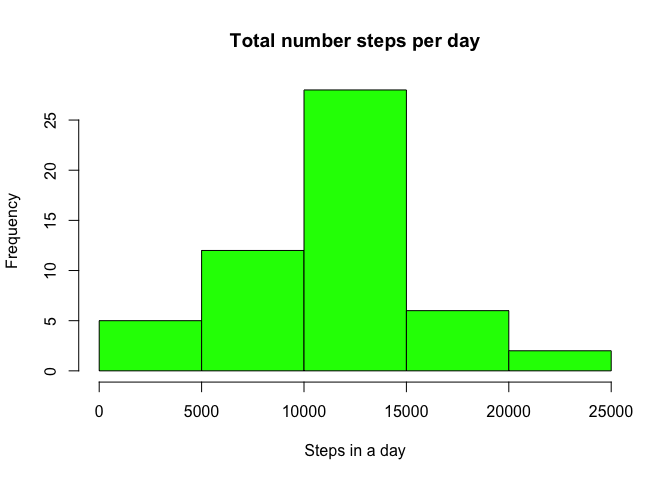
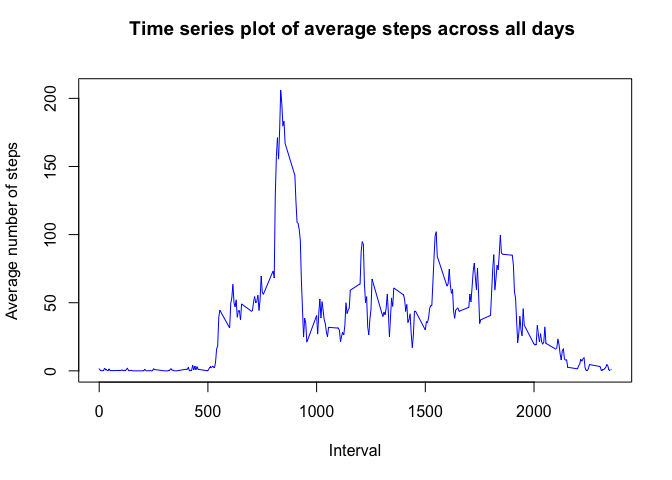
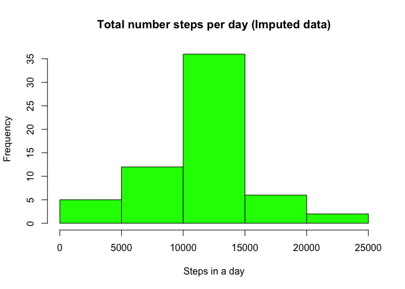
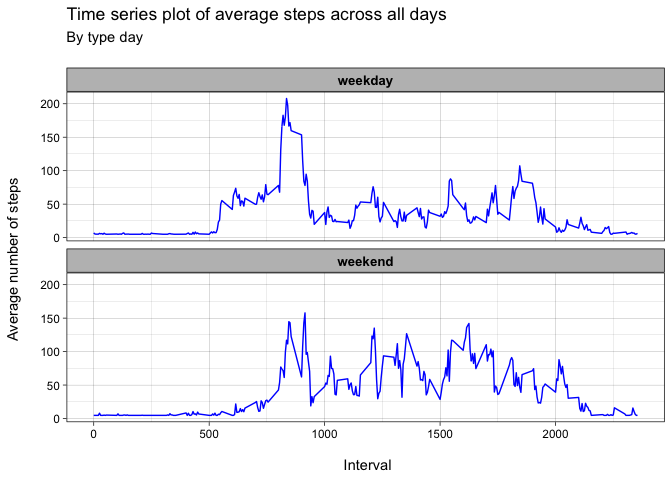

## Introduction 
___
The database contains a large amount of information on personal movement using activity tracking devices(atd). These devices collect data in 5-minute intervals throughout the day from an anonymous individual during the October and November 2012 months and include the number of steps taken in 5-minute intervals each day.


## Enviroment preparation 
____
A good practice before starting any project is to clean the environment and load libraries to be used. 

```r
## Clean the enviroment
rm(list=ls())

## Load libraries
library(tidyverse)
```

```
## ── Attaching packages ─────────────────────────────────────── tidyverse 1.3.2 ──
## ✔ ggplot2 3.4.2     ✔ purrr   1.0.1
## ✔ tibble  3.2.1     ✔ dplyr   1.1.1
## ✔ tidyr   1.3.0     ✔ stringr 1.5.0
## ✔ readr   2.1.2     ✔ forcats 0.5.2
## ── Conflicts ────────────────────────────────────────── tidyverse_conflicts() ──
## ✖ dplyr::filter() masks stats::filter()
## ✖ dplyr::lag()    masks stats::lag()
```


## Loading and preprocessing the data
___
We load the data and take an overview of its structure.

```r
## Load the data
raw_tracking <- read_csv("../data/activity.zip")
```

```
## Rows: 17568 Columns: 3
## ── Column specification ────────────────────────────────────────────────────────
## Delimiter: ","
## dbl  (2): steps, interval
## date (1): date
## 
## ℹ Use `spec()` to retrieve the full column specification for this data.
## ℹ Specify the column types or set `show_col_types = FALSE` to quiet this message.
```

```r
## Inspect the data
raw_tracking%>%glimpse
```

```
## Rows: 17,568
## Columns: 3
## $ steps    <dbl> NA, NA, NA, NA, NA, NA, NA, NA, NA, NA, NA, NA, NA, NA, NA, N…
## $ date     <date> 2012-10-01, 2012-10-01, 2012-10-01, 2012-10-01, 2012-10-01, …
## $ interval <dbl> 0, 5, 10, 15, 20, 25, 30, 35, 40, 45, 50, 55, 100, 105, 110, …
```

```r
## Process the data cleaning the NAs value
tracking_df <- raw_tracking%>%
          drop_na()
```
We can observe that database contains only 3 variables and 17 568 observations. But `steps` variable contains a large number of NA's. 


## Questions 
_____
### Question 1
What is mean total number of steps taken per day?


```r
## Calculate total number of steps taken per day
total_steps <- tracking_df%>%
          group_by(date)%>%
          summarise(sum_steps=sum(steps, na.rm=TRUE))%>%
          print()
```

```
## # A tibble: 53 × 2
##    date       sum_steps
##    <date>         <dbl>
##  1 2012-10-02       126
##  2 2012-10-03     11352
##  3 2012-10-04     12116
##  4 2012-10-05     13294
##  5 2012-10-06     15420
##  6 2012-10-07     11015
##  7 2012-10-09     12811
##  8 2012-10-10      9900
##  9 2012-10-11     10304
## 10 2012-10-12     17382
## # ℹ 43 more rows
```

```r
## Make a histogram of the total number of steps taken each day
with(total_steps, hist(sum_steps, col="green", 
               main="Total number steps per day",
               xlab="Steps in a day"))
```

<!-- -->

```r
## Calculate and report the mean and median of the total number of steps taken per day
total_steps%>%
          summarise(mean_steps=mean(sum_steps, na.rm=TRUE), 
                    median_steps=median(sum_steps, na.rm = TRUE))
```

```
## # A tibble: 1 × 2
##   mean_steps median_steps
##        <dbl>        <dbl>
## 1     10766.        10765
```
The average total number of steps per day is **10766**, and the median is **10765**. According the results we can say that data has a normal distribution.


### Question 2
What is the average daily activity pattern?


```r
# Make a time series plot (i.e. type = "l") of the 5-minute interval (x-axis) and the average number of steps taken, averaged across all days (y-axis)
mean_interval <- tracking_df%>%
          group_by(interval)%>%
          summarise(mean_steps=mean(steps))%>%
          print()
```

```
## # A tibble: 288 × 2
##    interval mean_steps
##       <dbl>      <dbl>
##  1        0     1.72  
##  2        5     0.340 
##  3       10     0.132 
##  4       15     0.151 
##  5       20     0.0755
##  6       25     2.09  
##  7       30     0.528 
##  8       35     0.868 
##  9       40     0     
## 10       45     1.47  
## # ℹ 278 more rows
```

```r
with(mean_interval, plot(x= interval, y= mean_steps, type="l", col="blue", 
               main="Time series plot of average steps across all days \n",
               xlab="Interval", ylab="Average number of steps"))
```

<!-- -->

```r
# Which 5-minute interval, on average across all the days in the dataset, contains the maximum number of steps?
mean_interval%>%
          arrange(desc(mean_steps))%>%
          slice(1)%>%
          pull(interval)
```

```
## [1] 835
```
The interval with the maximum mean number of steps is **835**, with a mean of 206.17 steps. 

### Question 3
Imputing missing values

```r
# Calculate and report the total number of missing values in the dataset (i.e. the total number of rows with NANAs)
raw_tracking%>%
          summarise_all(~sum(is.na(.)))
```

```
## # A tibble: 1 × 3
##   steps  date interval
##   <int> <int>    <int>
## 1  2304     0        0
```

```r
# Devise a strategy for filling in all of the missing values in the dataset. The strategy does not need to be sophisticated. For example, you could use the mean/median for that day, or the mean for that 5-minute interval, etc.

# One possibility is to use the mean 

# Create a new dataset that is equal to the original dataset but with the missing data filled in.
fill_tracking <- raw_tracking%>%
          mutate(across(everything(), \(.) replace_na(., mean(., na.rm = TRUE))),
                 across(where(is.numeric),round,4))%>%
          print()
```

```
## Warning: There was 1 warning in `mutate()`.
## ℹ In argument: `across(where(is.numeric), round, 4)`.
## Caused by warning:
## ! The `...` argument of `across()` is deprecated as of dplyr 1.1.0.
## Supply arguments directly to `.fns` through an anonymous function instead.
## 
##   # Previously
##   across(a:b, mean, na.rm = TRUE)
## 
##   # Now
##   across(a:b, \(x) mean(x, na.rm = TRUE))
```

```
## # A tibble: 17,568 × 3
##    steps date       interval
##    <dbl> <date>        <dbl>
##  1  37.4 2012-10-01        0
##  2  37.4 2012-10-01        5
##  3  37.4 2012-10-01       10
##  4  37.4 2012-10-01       15
##  5  37.4 2012-10-01       20
##  6  37.4 2012-10-01       25
##  7  37.4 2012-10-01       30
##  8  37.4 2012-10-01       35
##  9  37.4 2012-10-01       40
## 10  37.4 2012-10-01       45
## # ℹ 17,558 more rows
```

```r
## Calculate total number of steps taken per day
fill_total_steps <- fill_tracking%>%
          group_by(date)%>%
          summarise(sum_steps=sum(steps, na.rm=TRUE))%>%
          print()
```

```
## # A tibble: 61 × 2
##    date       sum_steps
##    <date>         <dbl>
##  1 2012-10-01    10766.
##  2 2012-10-02      126 
##  3 2012-10-03    11352 
##  4 2012-10-04    12116 
##  5 2012-10-05    13294 
##  6 2012-10-06    15420 
##  7 2012-10-07    11015 
##  8 2012-10-08    10766.
##  9 2012-10-09    12811 
## 10 2012-10-10     9900 
## # ℹ 51 more rows
```

```r
## Make a histogram of the total number of steps taken each day 
with(fill_total_steps, hist(sum_steps, col="green", 
               main="Total number steps per day (Imputed data)",
               xlab="Steps in a day"))
```

<!-- -->

```r
# Calculate and report the mean and median total number of steps taken per day. 
fill_total_steps%>%
          summarise(mean_steps=mean(sum_steps, na.rm=TRUE), 
                    median_steps=median(sum_steps, na.rm=TRUE))
```

```
## # A tibble: 1 × 2
##   mean_steps median_steps
##        <dbl>        <dbl>
## 1     10766.       10766.
```

```r
# Do these values differ from the estimates from the first part of the assignment? What is the impact of imputing missing data on the estimates of the total daily number of steps?
```

While there is **no difference between the mean**, a **subtle difference exists between the median** values. The impact of imputing missing data may depends on the data distribution. 


### Question 4
Are there differences in activity patterns between weekdays and weekends?


```r
# Create a new factor variable in the dataset with two levels – “weekday” and “weekend” indicating whether a given date is a weekday or weekend day.
fill_tracking_daytype <- fill_tracking%>%
          mutate(day=weekdays(date), 
                 day_type=case_when(day=="Saturday" | day=="Sunday"~ "weekend", 
                                    TRUE~ "weekday"))

# Make a panel plot containing a time series plot (i.e. type = "l"type = "l") of the 5-minute interval (x-axis) and the average number of steps taken, averaged across all weekday days or weekend days (y-axis).

## Calculate the mean steps interval by day type
fill_mean_interval <- fill_tracking_daytype%>%
          group_by(interval, day_type)%>%
          summarise(mean_steps=mean(steps))%>%
          print()
```

```
## `summarise()` has grouped output by 'interval'. You can override using the
## `.groups` argument.
```

```
## # A tibble: 576 × 3
## # Groups:   interval [288]
##    interval day_type mean_steps
##       <dbl> <chr>         <dbl>
##  1        0 weekday        7.01
##  2        0 weekend        4.67
##  3        5 weekday        5.38
##  4        5 weekend        4.67
##  5       10 weekday        5.14
##  6       10 weekend        4.67
##  7       15 weekday        5.16
##  8       15 weekend        4.67
##  9       20 weekday        5.07
## 10       20 weekend        4.67
## # ℹ 566 more rows
```

```r
## Graph
fill_mean_interval%>%
          ggplot(aes(x=interval, y=mean_steps))+
          geom_line(color="blue")+
          facet_wrap(.~day_type, nrow = 2)+
          labs(title = "Time series plot of average steps across all days", 
               subtitle = "By type day \n", 
               x=" \n Interval", y="Average number of steps \n")+
          theme_linedraw()+
          theme(strip.background = element_rect(fill = "gray"), 
                strip.text.x  = element_text(size=10, color="black", face = "bold"))
```

<!-- -->

There are different patterns according type of day. 
