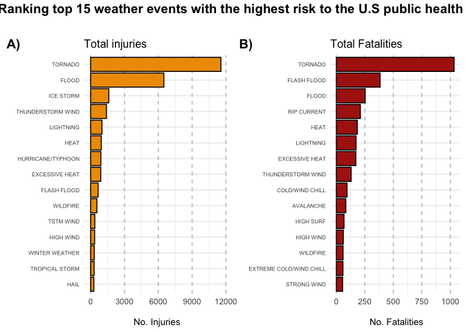
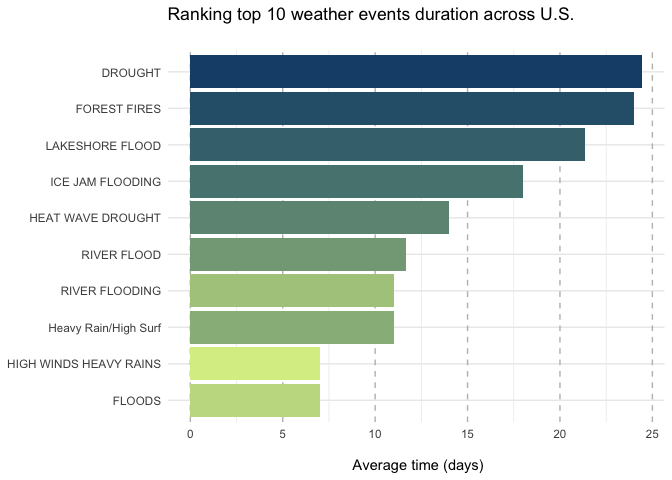

## Synopsis
___
**Introduction**: The U.S. National Oceanic and Atmospheric Administration's (NOAA) storm database is a comprehensive collection of data on severe weather events in the United States. It includes information on storms such as hurricanes, tornadoes, hailstorms, thunderstorms, and other weather phenomena, dating back to the 1950s. Many severe events can result in fatalities, injuries, and property damage, and preventing such outcomes to the extent possible is a key concern. **Justification**: The project would provide insights into the types of events that pose the greatest risk to public health and have the greatest economic consequences, which could be used to inform policy decisions related to disaster preparedness and emergency response. **Objective**: We aim to identify the types of severe weather events that have the greatest impact on population health and the economy in the United State by analyzing data from the NOAA storm database. **Results**: We found that tornadoes are the weather event with the highest rate of injuries and fatalities. While floods have the highest rates of property and agricultural damage.**Conclusions**: Public initiatives and policies are required in order to be prepared to respond in case of an emergency derived from weather events.


```r
## Enviroment preparation 

## Clean the enviroment
rm(list=ls())

## Load libraries
library(tidyverse)
```

```
## ── Attaching packages ─────────────────────────────────────── tidyverse 1.3.2 ──
## ✔ ggplot2 3.4.2     ✔ purrr   1.0.1
## ✔ tibble  3.2.1     ✔ dplyr   1.1.1
## ✔ tidyr   1.3.0     ✔ stringr 1.5.0
## ✔ readr   2.1.2     ✔ forcats 0.5.2
## ── Conflicts ────────────────────────────────────────── tidyverse_conflicts() ──
## ✖ dplyr::filter() masks stats::filter()
## ✖ dplyr::lag()    masks stats::lag()
```

```r
library(lubridate)
```

```
## 
## Attaching package: 'lubridate'
## 
## The following objects are masked from 'package:base':
## 
##     date, intersect, setdiff, union
```

```r
library(ggpubr)
library(scales)
```

```
## 
## Attaching package: 'scales'
## 
## The following object is masked from 'package:purrr':
## 
##     discard
## 
## The following object is masked from 'package:readr':
## 
##     col_factor
```
## Loading and processing the data
___

### Loading data

The data for this assignment come in the form of a comma-separated-value file compressed via the bzip2 algorithm to reduce its size. It can be downloaded from [here](https://www.coursera.org/learn/reproducible-research/peer/OMZ37/course-project-2#:~:text=course%20web%20site%3A-,Storm%20Data,-%5B47Mb%5D).


```r
## Load the data :::::::::::::::::::::::::::::::::::::::::::::::::::::::::::::::::::::::::::::::::::::
###  Download the file from the URL
temp <- tempfile()
download.file("https://d396qusza40orc.cloudfront.net/repdata%2Fdata%2FStormData.csv.bz2", temp)

### Read the csv file using read_csv()
storm_data <- read_csv(bzfile(temp))
```

```
## Rows: 902297 Columns: 37
## ── Column specification ────────────────────────────────────────────────────────
## Delimiter: ","
## chr (18): BGN_DATE, BGN_TIME, TIME_ZONE, COUNTYNAME, STATE, EVTYPE, BGN_AZI,...
## dbl (18): STATE__, COUNTY, BGN_RANGE, COUNTY_END, END_RANGE, LENGTH, WIDTH, ...
## lgl  (1): COUNTYENDN
## 
## ℹ Use `spec()` to retrieve the full column specification for this data.
## ℹ Specify the column types or set `show_col_types = FALSE` to quiet this message.
```

```r
### Overview
storm_data%>%
          glimpse()
```

```
## Rows: 902,297
## Columns: 37
## $ STATE__    <dbl> 1, 1, 1, 1, 1, 1, 1, 1, 1, 1, 1, 1, 1, 1, 1, 1, 1, 1, 1, 1,…
## $ BGN_DATE   <chr> "4/18/1950 0:00:00", "4/18/1950 0:00:00", "2/20/1951 0:00:0…
## $ BGN_TIME   <chr> "0130", "0145", "1600", "0900", "1500", "2000", "0100", "09…
## $ TIME_ZONE  <chr> "CST", "CST", "CST", "CST", "CST", "CST", "CST", "CST", "CS…
## $ COUNTY     <dbl> 97, 3, 57, 89, 43, 77, 9, 123, 125, 57, 43, 9, 73, 49, 107,…
## $ COUNTYNAME <chr> "MOBILE", "BALDWIN", "FAYETTE", "MADISON", "CULLMAN", "LAUD…
## $ STATE      <chr> "AL", "AL", "AL", "AL", "AL", "AL", "AL", "AL", "AL", "AL",…
## $ EVTYPE     <chr> "TORNADO", "TORNADO", "TORNADO", "TORNADO", "TORNADO", "TOR…
## $ BGN_RANGE  <dbl> 0, 0, 0, 0, 0, 0, 0, 0, 0, 0, 0, 0, 0, 0, 0, 0, 0, 0, 0, 0,…
## $ BGN_AZI    <chr> NA, NA, NA, NA, NA, NA, NA, NA, NA, NA, NA, NA, NA, NA, NA,…
## $ BGN_LOCATI <chr> NA, NA, NA, NA, NA, NA, NA, NA, NA, NA, NA, NA, NA, NA, NA,…
## $ END_DATE   <chr> NA, NA, NA, NA, NA, NA, NA, NA, NA, NA, NA, NA, NA, NA, NA,…
## $ END_TIME   <chr> NA, NA, NA, NA, NA, NA, NA, NA, NA, NA, NA, NA, NA, NA, NA,…
## $ COUNTY_END <dbl> 0, 0, 0, 0, 0, 0, 0, 0, 0, 0, 0, 0, 0, 0, 0, 0, 0, 0, 0, 0,…
## $ COUNTYENDN <lgl> NA, NA, NA, NA, NA, NA, NA, NA, NA, NA, NA, NA, NA, NA, NA,…
## $ END_RANGE  <dbl> 0, 0, 0, 0, 0, 0, 0, 0, 0, 0, 0, 0, 0, 0, 0, 0, 0, 0, 0, 0,…
## $ END_AZI    <chr> NA, NA, NA, NA, NA, NA, NA, NA, NA, NA, NA, NA, NA, NA, NA,…
## $ END_LOCATI <chr> NA, NA, NA, NA, NA, NA, NA, NA, NA, NA, NA, NA, NA, NA, NA,…
## $ LENGTH     <dbl> 14.0, 2.0, 0.1, 0.0, 0.0, 1.5, 1.5, 0.0, 3.3, 2.3, 1.3, 4.7…
## $ WIDTH      <dbl> 100, 150, 123, 100, 150, 177, 33, 33, 100, 100, 400, 400, 2…
## $ F          <dbl> 3, 2, 2, 2, 2, 2, 2, 1, 3, 3, 1, 1, 3, 3, 3, 4, 1, 1, 1, 1,…
## $ MAG        <dbl> 0, 0, 0, 0, 0, 0, 0, 0, 0, 0, 0, 0, 0, 0, 0, 0, 0, 0, 0, 0,…
## $ FATALITIES <dbl> 0, 0, 0, 0, 0, 0, 0, 0, 1, 0, 0, 0, 1, 0, 0, 4, 0, 0, 0, 0,…
## $ INJURIES   <dbl> 15, 0, 2, 2, 2, 6, 1, 0, 14, 0, 3, 3, 26, 12, 6, 50, 2, 0, …
## $ PROPDMG    <dbl> 25.0, 2.5, 25.0, 2.5, 2.5, 2.5, 2.5, 2.5, 25.0, 25.0, 2.5, …
## $ PROPDMGEXP <chr> "K", "K", "K", "K", "K", "K", "K", "K", "K", "K", "M", "M",…
## $ CROPDMG    <dbl> 0, 0, 0, 0, 0, 0, 0, 0, 0, 0, 0, 0, 0, 0, 0, 0, 0, 0, 0, 0,…
## $ CROPDMGEXP <chr> NA, NA, NA, NA, NA, NA, NA, NA, NA, NA, NA, NA, NA, NA, NA,…
## $ WFO        <chr> NA, NA, NA, NA, NA, NA, NA, NA, NA, NA, NA, NA, NA, NA, NA,…
## $ STATEOFFIC <chr> NA, NA, NA, NA, NA, NA, NA, NA, NA, NA, NA, NA, NA, NA, NA,…
## $ ZONENAMES  <chr> NA, NA, NA, NA, NA, NA, NA, NA, NA, NA, NA, NA, NA, NA, NA,…
## $ LATITUDE   <dbl> 3040, 3042, 3340, 3458, 3412, 3450, 3405, 3255, 3334, 3336,…
## $ LONGITUDE  <dbl> 8812, 8755, 8742, 8626, 8642, 8748, 8631, 8558, 8740, 8738,…
## $ LATITUDE_E <dbl> 3051, 0, 0, 0, 0, 0, 0, 0, 3336, 3337, 3402, 3404, 0, 3432,…
## $ LONGITUDE_ <dbl> 8806, 0, 0, 0, 0, 0, 0, 0, 8738, 8737, 8644, 8640, 0, 8540,…
## $ REMARKS    <chr> NA, NA, NA, NA, NA, NA, NA, NA, NA, NA, NA, NA, NA, NA, NA,…
## $ REFNUM     <dbl> 1, 2, 3, 4, 5, 6, 7, 8, 9, 10, 11, 12, 13, 14, 15, 16, 17, …
```

```r
## Inspect the variable names
colnames(storm_data)
```

```
##  [1] "STATE__"    "BGN_DATE"   "BGN_TIME"   "TIME_ZONE"  "COUNTY"    
##  [6] "COUNTYNAME" "STATE"      "EVTYPE"     "BGN_RANGE"  "BGN_AZI"   
## [11] "BGN_LOCATI" "END_DATE"   "END_TIME"   "COUNTY_END" "COUNTYENDN"
## [16] "END_RANGE"  "END_AZI"    "END_LOCATI" "LENGTH"     "WIDTH"     
## [21] "F"          "MAG"        "FATALITIES" "INJURIES"   "PROPDMG"   
## [26] "PROPDMGEXP" "CROPDMG"    "CROPDMGEXP" "WFO"        "STATEOFFIC"
## [31] "ZONENAMES"  "LATITUDE"   "LONGITUDE"  "LATITUDE_E" "LONGITUDE_"
## [36] "REMARKS"    "REFNUM"
```

The database contains detailed information on storm characteristics, such as the date, time, location, wind speed, and precipitation amounts. It also includes information on the damage caused by the storms, including property damage, injuries, and fatalities. The events in the database start in the year 1950 and end in November 2011.


### Processing data
Since we are only interested in certain variables to answer our research questions, we selected the storm event type (`EVTYPE`), the beging (`BGN_DATE`) and end (`END_DATE`) date and State (`EVTYPE`) as well as those  variables related to health, such as amount of fatalities per event (`FATALITIES`) and amount of injuries per event (`INJURIES`), and to economics, like property (`PROPDMG`) and crop (`CROPDMG`) damage amount and their exponent value (`PROPDMGEXP` and `CROPDMGEXP`). 

```r
## Processing the data :::::::::::::::::::::::::::::::::::::::::::::::::::::::::::::::::::::::::
### Select research variables
storm_interes <- storm_data%>%
          select(BGN_DATE, END_DATE, STATE, EVTYPE, FATALITIES, INJURIES, PROPDMG, PROPDMGEXP, CROPDMG, CROPDMGEXP)

## Imput NAs 
### Summarise NA data across variables
storm_interes%>%
          summarise_all(~sum(is.na(.)))
```

```
## # A tibble: 1 × 10
##   BGN_DATE END_DATE STATE EVTYPE FATALITIES INJURIES PROPDMG PROPDMGEXP CROPDMG
##      <int>    <int> <int>  <int>      <int>    <int>   <int>      <int>   <int>
## 1        0   243411     0      0          0        0       0     465934       0
## # ℹ 1 more variable: CROPDMGEXP <int>
```

```r
### Remove NAs
storm_interes <- storm_interes%>%
          drop_na()


## Transform data type
storm_research <- storm_interes%>%
          mutate(BGN_DATE=mdy_hms(BGN_DATE), 
                 END_DATE=mdy_hms(END_DATE))%>%
          mutate_at(vars(STATE, EVTYPE),as.factor)%>%
          mutate_at(vars(PROPDMGEXP,CROPDMGEXP),~case_when(.=="B"~1e+09, 
                                                           .=="M"~1e+06, 
                                                           .=="m"~1e+06,
                                                           .=="K"~1e+03,
                                                           .=="5"~10,
                                                           .=="0"~0))%>%
          mutate(PROPDMG=PROPDMG*PROPDMGEXP, 
                 CROPDMG=CROPDMG*CROPDMGEXP, 
                 EV_DURATION_S=as.numeric(END_DATE-BGN_DATE), 
                 EV_DURATION=EV_DURATION_S/ (24*3600))%>%
          select(EV_DURATION, STATE, EVTYPE, FATALITIES,INJURIES, PROPDMG, CROPDMG)%>%
          rename_all(tolower)%>%
          print()
```

```
## # A tibble: 277,144 × 7
##    ev_duration state evtype                  fatalities injuries propdmg cropdmg
##          <dbl> <fct> <fct>                        <dbl>    <dbl>   <dbl>   <dbl>
##  1           1 AL    HURRICANE OPAL/HIGH WI…          2        0  1   e8     1e7
##  2           0 AL    THUNDERSTORM WINDS               0        0  5   e6     5e5
##  3           1 AL    HURRICANE OPAL                   0        0  4.80e7     4e6
##  4           1 AL    HURRICANE OPAL                   0        0  2   e7     1e7
##  5           0 AL    THUNDERSTORM WINDS HAIL          0        0  2.5 e4     1e4
##  6           0 AL    THUNDERSTORM WINDS               0        0  5   e5     5e5
##  7           5 AL    FLOODING                         2        0  5   e7     5e6
##  8           5 AL    HEAVY RAIN                       2        0  5   e7     5e6
##  9           7 AK    HIGH WINDS HEAVY RAINS           0        0  7.5 e6     1e4
## 10           3 CA    WINTER STORM                     3        5  5   e6     5e6
## # ℹ 277,134 more rows
```


We observe that `PROPDMGEXP` has a total of 465934 missing values, while `CROPDMGEXP` has 618413 missing values. We remove these values with `drop_na` function from `dplyr` package. Moreover, we transform `character`type data into `factor`, and date time into their corresponding data type. Also we uniform the amount of fatalities and crop damage values according their exponent values. Finally we obtain the event duration using end day minus begining day.  


## Results
___

As part of the study we want to know which types of events are most harmful with respect to population health across the United States. We will focus our analysis in health variables using the `storm_research` database. 


```r
## Select only health variables
storm_health <- storm_research%>%
          select(evtype, fatalities, injuries)%>%
          pivot_longer(cols = c("fatalities", "injuries"), names_to = "health", values_to = "value")%>%
          arrange(desc(value))

## Graph injuries
plot_injuries <- storm_health%>%
          filter(health=="injuries")%>%
          group_by(evtype)%>%
          summarise(total_injuries=sum(value), .groups = "drop")%>%
          arrange(desc(total_injuries))%>%
          slice_head(n=15)%>%
          ggplot(aes(x=fct_reorder(evtype, total_injuries), y=total_injuries))+
          geom_bar(position = "dodge", stat="identity", color = "black", fill = "#ee9b00")+
          coord_flip()+
          labs(title ="Total injuries", 
               x="", y="\n No. Injuries")+
          theme_minimal()+
                  theme(title  = element_text(size=10), 
                        axis.text.y = element_text(size=6), 
                        panel.grid.major.x = element_line(color = "gray", linetype = 8))


## Graph fatalities
plot_fatalities <- storm_health%>%
          filter(health=="fatalities")%>%
          group_by(evtype)%>%
          summarise(total_fatalities=sum(value), .groups = "drop")%>%
          arrange(desc(total_fatalities))%>%
          slice_head(n=15)%>%
          ggplot(aes(x=fct_reorder(evtype, total_fatalities), y=total_fatalities))+
          geom_bar(position = "dodge", stat="identity", color="black", fill = "#ae2012")+
          coord_flip()+
          labs(title ="Total Fatalities", 
               x="", y="\n No. Fatalities")+
          theme_minimal()+
                  theme(title  = element_text(size=10), 
                        axis.text.y = element_text(size=6), 
                        panel.grid.major.x = element_line(color = "gray", linetype = 8))


figure <- ggarrange(plot_injuries, plot_fatalities, labels = c("A)", "B)"))

annotate_figure(figure, top = 
                          text_grob("Ranking top 15 weather events with the highest risk to the U.S public health \n",
                                    face="bold",size=14))
```

<!-- -->

    
Based on the evidence, we can observe that the meteorological event with the highest injury (**Figure A**) and fatality (**Figure B**) rates are tornadoes. In particular, it can also be observed that ice storms cause a large number of injuries but no fatalities. While rip currents cause several fatalities but no injuries. 


We also want to know which types of events have the greatest economic consequences Across the United States. In this case, we will focus our analysis in economic variables using the `storm_research` database.


```r
## Select only economic variables
storm_economic <- storm_research%>%
          select(evtype, propdmg, cropdmg)%>%
          pivot_longer(cols = c("cropdmg", "propdmg"), names_to = "economic", values_to = "value")%>%
          arrange(desc(value))


## Graph property damage
plot_propdmg <- storm_economic%>%
          filter(economic=="propdmg")%>%
          group_by(evtype)%>%
          summarise(total_propdmg=sum(value), .groups = "drop")%>%
          arrange(desc(total_propdmg))%>%
          slice_head(n=15)%>%
          ggplot(aes(x=fct_reorder(evtype, total_propdmg), y=total_propdmg))+
          geom_bar(position = "dodge", stat="identity", color = "black", fill = "#94D2BD")+
          coord_flip()+
          scale_y_continuous(labels = dollar_format())+
          labs(title ="Total property damage", 
               x="", y="\n Property damage")+
          theme_minimal()+
          theme(title  = element_text(size=10), 
                axis.text.x = element_text(angle = 30, vjust=0.9, hjust = 0.9),
                axis.text.y = element_text(size=6), 
                panel.grid.major.x = element_line(color = "gray", linetype = 8))


## Graph according crop damage 
plot_cropdmg <- storm_economic%>%
          filter(economic=="cropdmg")%>%
          group_by(evtype)%>%
          summarise(total_cropdmg=sum(value), .groups = "drop")%>%
          arrange(desc(total_cropdmg))%>%
          slice_head(n=15)%>%
          ggplot(aes(x=fct_reorder(evtype, total_cropdmg), y=total_cropdmg))+
          geom_bar(position = "dodge", stat="identity", color="black", fill = "#005f73")+
          coord_flip()+
          scale_y_continuous(labels = dollar_format())+
          labs(title ="Total crop damage", 
               x="", y="\n Crop damage")+
          theme_minimal()+
          theme(title  = element_text(size=10), 
                axis.text.x = element_text(angle = 30, vjust=0.9, hjust = 0.9),
                axis.text.y = element_text(size=6), 
                panel.grid.major.x = element_line(color = "gray", linetype = 8))

## 
figure2 <- ggarrange(plot_propdmg, plot_cropdmg, labels = c("A)", "B)"))

annotate_figure(figure2, top = 
                          text_grob("Ranking top 15 weather events with the highest risk to U.S. public economy\n",
                                    face="bold",size=14))
```

<!-- -->
     

From an economic point of view, floods have the highest rates of property (**Figure A**) and agricultural (**Figure B**) damage. In terms of property damage, the most severe weather events are hurricanes and tornadoes, while ice storms cause similar damage to crops as floods. 


With the previous results we wanted to find out which meteorological event has a higher median duration.  


```r
## Set color palette
pal <- colorRampPalette(c("#184e77","#d9ed92"))

## Graph according mean duration of each event type (top10) 
storm_research%>%
          group_by(evtype)%>%
          summarise(mean_event=mean(ev_duration))%>%
          arrange(desc(mean_event))%>%
          slice_head(n=10)%>%
          ggplot(aes(x=fct_reorder(evtype, mean_event), y = mean_event))+
          geom_bar(stat="identity", fill=pal(10))+
                    coord_flip()+
          labs(title = "Ranking top 10 weather events duration across U.S. \n",
               x=NULL, 
               y="\n Average time (days)")+
          theme_minimal()+
          theme(panel.grid.major.x = element_line(color = "gray", linetype = 8))
```

<!-- -->
    
We can observe that droughts occupy the first position with a longer average duration, which is important from an economic point of view as it represents a risk of money loss due to crop damage.  Floods occupy the tenth position, which is alarming because this meteorological phenomenon has important consequences for public health and the U.S. economy. Public initiatives and policies are required in order to prevent disasters or, at least, to be prepared to respond in case of an emergency. 


```r
sessionInfo()
```

```
## R version 4.1.2 (2021-11-01)
## Platform: x86_64-apple-darwin17.0 (64-bit)
## Running under: macOS Mojave 10.14.6
## 
## Matrix products: default
## BLAS:   /Library/Frameworks/R.framework/Versions/4.1/Resources/lib/libRblas.0.dylib
## LAPACK: /Library/Frameworks/R.framework/Versions/4.1/Resources/lib/libRlapack.dylib
## 
## locale:
## [1] en_US.UTF-8/en_US.UTF-8/en_US.UTF-8/C/en_US.UTF-8/en_US.UTF-8
## 
## attached base packages:
## [1] stats     graphics  grDevices utils     datasets  methods   base     
## 
## other attached packages:
##  [1] scales_1.2.1    ggpubr_0.4.0    lubridate_1.8.0 forcats_0.5.2  
##  [5] stringr_1.5.0   dplyr_1.1.1     purrr_1.0.1     readr_2.1.2    
##  [9] tidyr_1.3.0     tibble_3.2.1    ggplot2_3.4.2   tidyverse_1.3.2
## 
## loaded via a namespace (and not attached):
##  [1] assertthat_0.2.1    digest_0.6.31       utf8_1.2.3         
##  [4] R6_2.5.1            cellranger_1.1.0    backports_1.4.1    
##  [7] reprex_2.0.2        evaluate_0.16       highr_0.9          
## [10] httr_1.4.4          pillar_1.9.0        rlang_1.1.0        
## [13] googlesheets4_1.0.1 readxl_1.4.1        rstudioapi_0.14    
## [16] car_3.1-0           jquerylib_0.1.4     rmarkdown_2.16     
## [19] labeling_0.4.2      googledrive_2.0.0   bit_4.0.4          
## [22] munsell_0.5.0       broom_1.0.1         compiler_4.1.2     
## [25] modelr_0.1.9        xfun_0.32           pkgconfig_2.0.3    
## [28] htmltools_0.5.4     tidyselect_1.2.0    gridExtra_2.3      
## [31] fansi_1.0.4         crayon_1.5.2        tzdb_0.3.0         
## [34] dbplyr_2.2.1        withr_2.5.0         grid_4.1.2         
## [37] jsonlite_1.8.4      gtable_0.3.3        lifecycle_1.0.3    
## [40] DBI_1.1.3           magrittr_2.0.3      vroom_1.5.7        
## [43] carData_3.0-5       cli_3.6.1           stringi_1.7.12     
## [46] cachem_1.0.6        farver_2.1.1        ggsignif_0.6.3     
## [49] fs_1.5.2            xml2_1.3.3          bslib_0.4.1        
## [52] ellipsis_0.3.2      generics_0.1.3      vctrs_0.6.1        
## [55] cowplot_1.1.2       tools_4.1.2         bit64_4.0.5        
## [58] glue_1.6.2          hms_1.1.2           parallel_4.1.2     
## [61] abind_1.4-5         fastmap_1.1.0       yaml_2.3.5         
## [64] colorspace_2.1-0    gargle_1.2.0        rstatix_0.7.0      
## [67] rvest_1.0.3         knitr_1.40          haven_2.5.1        
## [70] sass_0.4.4
```
